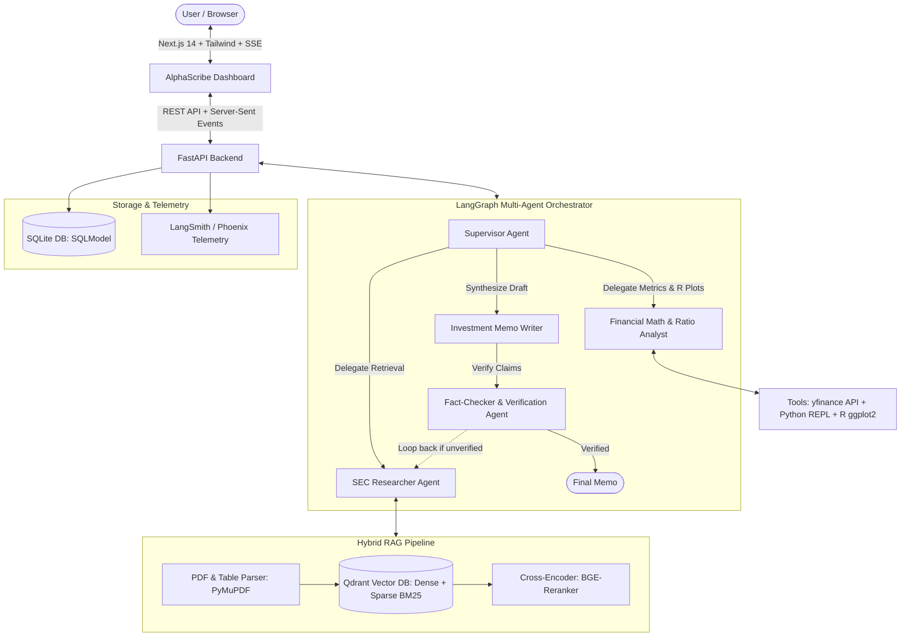

# AlphaScribe AI: Autonomous Financial & Market Research Analyst

[](https://www.python.org/)
[](https://nextjs.org/)
[](https://www.langchain.com/langgraph)
[](https://qdrant.tech/)
[](https://ggplot2.tidyverse.org/)
[](https://sqlmodel.tiangolo.com/)

**AlphaScribe AI** is an enterprise-grade, full-stack autonomous investment research platform. It automates financial document ingestion (10-K, 10-Q), hybrid semantic retrieval, deterministic ratio computation, publication-grade financial plotting, and verified investment memo synthesis.

---

## System Architecture



---

## Key Highlights & Innovations

1. **Stateful Multi-Agent Orchestration (LangGraph):**
   - Distinct, specialized agent roles (`Supervisor`, `Researcher`, `Analyst`, `Fact-Checker`, `Writer`).
   - Cyclical graph design: The `Fact-Checker` audits every quantitative claim against source chunks and triggers iterative revisions if citations are lacking.

2. **Advanced Hybrid RAG with Reranking:**
   - Ingests multi-column balance sheets and earnings tables via `PyMuPDF`.
   - Combines **Dense Embeddings** (semantic search) and **Sparse BM25** (exact financial keyword matching) via Qdrant.
   - Cross-encoder reranking filters top high-relevance chunks to eliminate context clutter.

3. **Deterministic Financial Math & Dual-Engine Visualization:**
   - **Zero Arithmetic Hallucination:** Computes CAGR, debt coverage, and margins programmatically using a sandboxed Python REPL and live `yfinance` data.
   - **Publication-Grade Financial Charts via R (`ggplot2`):** Python orchestrates R scripts to render Wall Street-grade financial plots embedded in the final memo.
   - **Interactive Web UI:** Interactive client-side charting powered by **Recharts**.

4. **Zero-Configuration SQLite Persistence:**
   - Fully typed data models using **SQLModel** (combining Pydantic validation and SQLAlchemy ORM).
   - Zero setup required: Instant local execution without external database containers.

5. **Production-Ready Observability & Evals:**
   - Built-in tracing with **LangSmith / Phoenix**.
   - Automated evaluation pipeline using **Ragas** measuring Faithfulness, Answer Relevance, and Context Precision.

---

## Tech Stack Summary

| Domain | Technologies |
| :--- | :--- |
| **Frontend** | Next.js 14 (App Router), TypeScript, Tailwind CSS, shadcn/ui, Recharts |
| **Backend & API** | FastAPI, Server-Sent Events (SSE), Pydantic, Python 3.11+ |
| **Agent Framework** | LangGraph, LangChain Core |
| **Vector DB & RAG** | Qdrant (Hybrid Search), BGE-M3 Embeddings, BGE-Reranker / FlashRank |
| **Data Viz** | R (`ggplot2`, `tidyquant`) + Recharts |
| **Database** | SQLite + SQLModel |
| **Tools** | `yfinance`, Python REPL |
| **Evals & Telemetry** | Ragas, LangSmith / Phoenix Arize |
| **Containerization** | Docker, Docker Compose |

---

## Detailed Documentation

- [System Architecture & Sequence Flow](docs/ARCHITECTURE.md)
- [Project Tech Stack Justification](docs/TECH_STACK.md)
- [Multi-Phase Execution Roadmap](docs/ROADMAP.md)
- [Resume Bullets & Interview Guide](docs/RESUME_POINTS.md)

---

## Getting Started (Quickstart)

### Prerequisites
- Python 3.11+
- Node.js 18+
- R 4.2+ (with `ggplot2` and `jsonlite`) *[Optional for local dev; automated in Docker]*
- Docker & Docker Compose *(recommended for full containerized run)*

### 1. Set Up Backend
```bash
cd backend
python -m venv .venv
# Activate environment:
# Windows: .venv\Scripts\activate
# Linux/Mac: source .venv/bin/activate

pip install -r requirements.txt
cp .env.example .env
```

### 2. Run Backend
```bash
uvicorn app.main:app --reload --port 8000
```
Interactive API docs available at: `http://localhost:8000/docs`

### 3. Run Frontend
```bash
cd ../frontend
npm install
npm run dev
```
Open `http://localhost:3000` to interact with the AlphaScribe AI dashboard.
