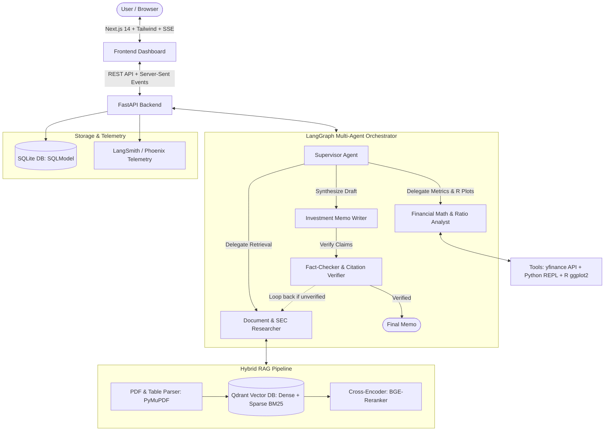
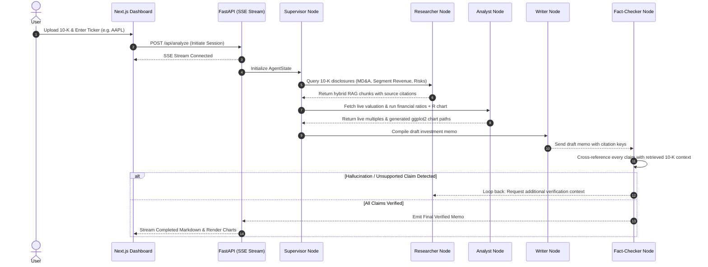
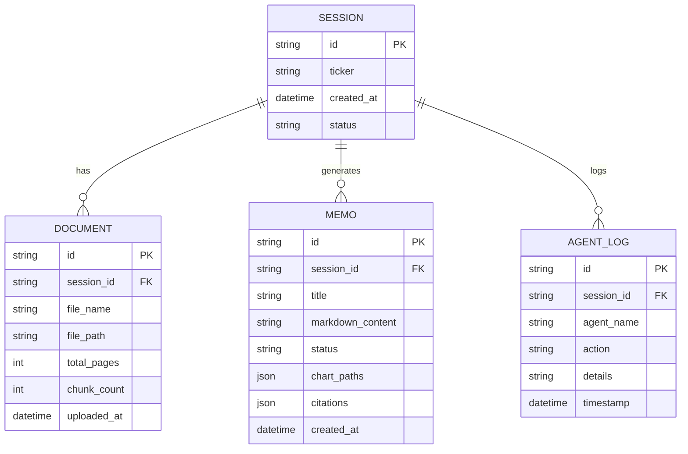

# System Architecture & Design

## 1. High-Level Architecture Flow



---

## 2. Multi-Agent Collaboration Protocol



---

## 3. Agent Responsibilities & Tools

### A. Supervisor Agent
* **Role:** State machine coordinator and router.
* **Logic:** Evaluates current `AgentState`, determines missing information, and triggers specialized worker agents until all sections are fulfilled.

### B. Researcher Agent
* **Role:** Unstructured financial document extraction.
* **Tools:**
  * `hybrid_search_tool`: Queries Qdrant dense vector embeddings + sparse BM25 indices.
  * `rerank_filter`: Filters candidate text chunks using a cross-encoder model.

### C. Financial Analyst Agent
* **Role:** Quantitative market intelligence and deterministic calculation.
* **Tools:**
  * `yfinance_tool`: Live stock quotes, enterprise value, trailing P/E, revenue history.
  * `python_repl_tool`: Sandboxed code execution for deterministic financial metrics (e.g., CAGR, ROIC, debt service coverage).
  * `r_chart_tool`: Executes R scripts using `ggplot2` to generate institutional-grade PNG/SVG charts.

### D. Fact-Checker Agent
* **Role:** Zero-tolerance hallucination barrier.
* **Logic:**
  * Extracts all numerical assertions, quotes, and forward-looking statements in the draft memo.
  * Checks if each assertion is explicitly backed by an indexed chunk ID in the retrieved context.
  * If unverified, flags the state with feedback and forces a graph iteration.

### E. Writer Agent
* **Role:** Institutional synthesis and structuring.
* **Output Format:** Professional Markdown investment memo containing:
  * Executive Summary & Investment Thesis
  * Valuation Multiples Table
  * Operational & Segment Analysis
  * Embedded R `ggplot2` Visualizations
  * Key Risks & Footnote Citations

---

## 4. Database Schema (SQLite via SQLModel)



---

## 5. Streaming API Contract

### `POST /api/analyze`
* **Request:**
  ```json
  {
    "ticker": "AAPL",
    "document_id": "doc_12345",
    "query": "Synthesize a 10-K investment memo focused on Services segment margins and CapEx."
  }
  ```
* **Response (SSE Event Stream):**
  * `event: node_start` $\to$ `{"node": "Researcher", "status": "Searching Qdrant for Services margin disclosures..."}`
  * `event: tool_call` $\to$ `{"tool": "r_chart_tool", "output": "/data/outputs/aapl_margins.png"}`
  * `event: verification` $\to$ `{"claims_verified": 14, "unverified": 0}`
  * `event: memo_chunk` $\to$ `{"delta": "### 1. Executive Summary\n\nApple's services revenue..."}`
  * `event: complete` $\to$ `{"memo_id": "memo_9876", "status": "COMPLETED"}`
